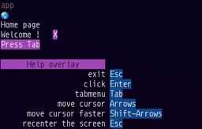

 ╔✨═🪨🪵═🪄🌙═🔮🌟  
 ║ UiTerminalMojo ║  
 ╰══════┼═════─═══╝  
 
  

#### Expect changes: Learning by building!
#### `+-60FPS`: Don't do I/O in the loop!
(Please read the framework part of the `README.MD`)

&nbsp;

🌌 But feel free to clone, experiment.  
Feel free to bootstrap a new framework.  
🐿️ Grab what you need and enjoy 💝  
Expect bugs 🤷 and bugfixes too!  
Don't use this `🚧work in progress` in production (or for serious things)  
It is early here for the enthusiastic community of builders  

&nbsp;

Dependencies  
└ No need to install anything extra, just `🪄magic` and `🔥mojo`.  

CPU need `🔢SIMD` vectors of at least 16 elements (`UInt8`)  
(For events)  

Printing some colors and getting a key press is very difficult (complexity).  
It would be nice to have this task well done by an external module.

Future plans:  
├ Integrate `TermBox2` (`>=v2.5.0`)  
│ 🫂Thanks to the person who created it and all the contributors.  
└ Integrate `Mog` and `Banjo` (Thanks to toasty 👍)  

&nbsp;

Mojo🔥 and 🪄Magic:  

💗 Thanks to modular team and all the contributors.  
I could not program lower level before mojo existed,
now it is fun and learning is easy.

🌟 Thanks to @owenhilyard for feedbacks and encouragements !

&nbsp;

---

&nbsp;

   
┼──────────────╮  ️  
│The framework ├─═   
╰──────────────╯     


It is a terminal user interface framework,  
where everything scales relatively🪗!  

We work inside a user defined while loop,  
logic and render on the fly. (`+-60FPS`)  
(no callbacks needed for events)

This "♾️loop" approach is "immediate mode",
here is a basic yet important guide:  
1. Please don't do File I/O on each frame
2. Please don't do HTTP requests on each frame
3. Don't forget that it is a just an loop  
4. Don't do anything that should not be done many times per second.  
   (`__copyinit__`, ..)

The screen have "infinite scroll" so far,  
user can move the 🮰cursor with ⬅️⬆️➡️⬇️.  
Pressing `shift` at the same time,  
and the cursor move faster (by 4)  

By pressing `Enter`,  
it is possible to `click` and interact.  
Pressing `Esc` re-center the screen `(0,0)`,  
and pressing again exit the app.  

The `Tab` key open/close the left TabMenu,  
it is another space for buttons and widgets.  
It emerges from the left-side of the screen,  
and when "tabbed out", the cursor moves back.  
(back where it was in the ui)  

The help overlay is a feature enabled by default,  
it's home is at the botton left of the screen,  
This 🌱 teaches all the ui keys quickly to users.  
It collapse and expand on cursor hover.

```python
Text("clear") | Bg.yellow | Fg.red in ui
if ui[-1].click():
    todos.clear()
```

&nbsp;

 ╔🪨═🪨🪵═🪨🪵═🪨🪵  
 ║ To get started ║  
 ╚════════════════╝  

```bash
git clone rd4com/tui
cd tui
magic shell
mojo run -I src examples/example_app.mojo
```
Stay tuned, this is only the first development phase,  
it should become a mojo community package (ecosystem) at time.  
(to integrate easily into existing projects with: `magic add`)

&nbsp;

╔══════════╗  
║ Features ║  🧰🔨🔧🪚📐  
╚══════════╝  
`mouse hover`  
`mouse click`  
`bg fg color`  
`relative -x` (refer to previous items)  
`immediate !` (all in the loop)  
`animations`  
`layouts`  
`border`  

&nbsp;

╔═════════╗  
║ Widgets ║  🎒  
╚═════════╝  
`help user overlay` 🤩🔦  
`selection group`  
`value selector`  
`list paginated`  
`notification`  (with fade-time)
`plot/chart` (`SIMD`)  
`percent bar`  
`tab menu` 🔄️  
`checkbox`  
`dropdown`  
`stepper` (progress status, numbered steps)  
`tooltip`  
`slider`  
`ticker`  
`center`  
`ljust`  
`rjust`  
`blink`  
`shake`  
`input`  
`tag`  

🎨 Some widgets have an theme parameter (example `[theme=Fg.magenta]`).

&nbsp;

╔════════════╗  
║ Animations ║  
╚════════════╝  
`spinners`  
`animate_time`  
`animate_emojis`  
`animate_simple_inline`  

&nbsp;

╔────────╗  
║ Border ║  
╰════════┘  

`StyleBorderSimple`  
`StyleBorderCurved`  
`StyleBorderDouble`  

And a trait `StyledBorder` for more (example: `╔──╗`)  

&nbsp;

### With theses basic `building blocks`,  
#### it is possible to create a lot fast!  
##### (nested scrollable zones are needed of course)  

See widgets implementations,  
few methods are actually needed to build things.  
(`design_api.md` one day)  

`ui.start_measuring()`  
`..do nested things..`
`some_measurement.peek_dimension()`  
`some_measurement^.stop_measuring()`  

`ui.move_cursor_after(some_completed_measurement^)`  
`ui.move_cursor_below(some_completed_measurement^)`  

`Text("Hello world") | Fg.green in ui`  

`ui[-2].click()`  
`ui[-1].hover()`  
`ui[-1] |= Bg.magenta`  

`start_border` and `end_border`  
(to use with measurement api, as borders are measured too!)

### 🧭 The plan:  
🤷🪄👷
(try meet new ideas by building)

&nbsp;

---

&nbsp;

🤗 Menu dropdown:  
 🪄 (from scratch)  
```python
Text("ShowTodos") | Bg.black | Fg.yellow in ui
if ui[-1].click():
    showtodos  = not showtodos

var idx=0
if showtodos:
    for t in todos:
        Text(String(idx,"   ",t[])) in ui
        if ui[-1].click():
            input_todo = todos.pop(idx)
        if ui[-1].hover():
            ui[-1]|=Bg.magenta
        idx+=1
```


⌨️ Input:
```python
var value = String("Hello!")
var edited = False
input_buffer["edit:"](
    ui, value, edited
)
```
Move the 🮰 cursor there and press `Enter`,  
⌨️ type an input,  
move the cursor elsewhere and that's it! 🪄  

&nbsp;

# Examples

In this folder-directory:  
[📂 examples](./examples)  
├ [🔥 tags](./examples/example_2_tag.mojo)  
├ [🔥 input](./examples/example_6_inputs.mojo)  
├ [🔥 table](./examples/example_table.mojo)  
├ [🔥 slider](./examples/example_slider.mojo)  
├ [🔥 tickers](./examples/example_7_ticker.mojo)  
├ [🔥 stepper](./examples/example_widget_steps.mojo)  
├ [🔥 tabmenu](./examples/example_app.mojo)  
├ [🔥 spinners](./examples/example_4_spinners.mojo)  
├ [🔥 spinners2](./examples/example_4_spinners2.mojo)  
├ [🔥 percent bar](./examples/example_percent_bar.mojo)  
├ [🔥 todo list app](./examples/example_app_todolist.mojo)  
├ [🔥 value selector](./examples/example_value_selector.mojo)  
├ [🔥 selection group](./examples/example_selection_group.mojo)  
├ [🔥 notification box](./examples/example_notification.mojo)  
├ [🔥 Collapsible menu](./examples/example_5_collapsible_menu.mojo)  
├ [🔥 help user overlay](./examples/example_0_help_overlay.mojo)  
├ [🔥 list view paginated](./examples/example_3_listview.mojo)  
└ [🔥 checkbox messagebox](./examples/example_checkbox_messagebox.mojo)  

&nbsp;

# Learn step by step

In this folder-directory:  
[📂 learn](./learn)  
├ [🔥 1. Hello World](./learn/learn_0_helloworld.mojo)  
├ [🔥 2. Hello Button](./learn/learn_1_hellobutton.mojo)  
├ [🔥 3. Hello Palette](./learn/learn_2_hellopalette.mojo)  
├ [🔥 4. Hello Layout](./learn/learn_3_hellolayout.mojo)  
├ [🔥 5. Hello widgets](./learn/learn_4_hellowidget.mojo)  
└ [🔥 6. Hello composition](./learn/learn_5_hellocomposition.mojo)  
└ [🔥 7. Hello Layout 2](./learn/learn_6_scalable_layouts.mojo)  
└ [🔥 8. Hello customized border](./learn/learn_7_customize_border.mojo)  
└ [🔥 9. Hello plot/chart](./learn/learn_8_plot.mojo)  

&nbsp;

### 📐📏 Layouts:

With few tools,  
it is possible to measure and move the cursor.

A measurement (`LinearType`) is used,  
to move the cursor *`below`* or *`after`* an area.

By nesting measurements,  
outer areas relatively scale to nested areas.

```
                 ┌─┐  ┌─┐
start_measuring─►│A│┌─│D│
                 │B││ │E│
stop_measuring ─►│C││ └─┘
                 └┬┘│
                  └─┘
ui.move_cursor_after(m)
```

&nbsp;

---

&nbsp;

Note:  
The ui automatically append and move the cursor below,  
measuring is not needed to vertically append:

```mojo
"First element" in ui
"Second" in ui
```

Result is:

```
First element
Second
```

Creating layouts can be learned when needed.

&nbsp;

---


##### Why `LinearType` ?
A started measurement cannot go out of scope,  
it can only become a completed measurement.  
Which can only by consumed by moving the cursor.  
(And all of theses can only be done explicitly)  

&nbsp;


##### How measurements can scale and compose:

```
Start measuring (a rectangle)
my_fancy_widget()
Stop measuring
```

This composes dynamically,  
because we let the widget do whatever it needs.  
Then just move the cursor below or after it.  
And this rectangle is the area that the widget used.  
So by moving below or after it, no overlap !  

But measurements are to be done in an orderly fashion,   
they don't solve all the possible bugs,  
removes a lot so far, which is good.

&nbsp;

So layouts like theses can scale:

```
While True:
 ↓ Cursor starts here
 ┌─────────────────────────┐┌────┐
 └─────────────────────────┘│    │
 ┌────┐┌───────────────────┐│    │
 │    ││┌───┐   ┌─┐┌─────┐ ││    │
 │    │││   │   │ ││     │ ││    │
 │    ││└───┘   └─┘│     │ ││    │
 │    ││┌──────┐   │     │ ││    │
 │    │││┌─┐┌─┐│   │     │ ││    │
 │    │││└─┘│ ││   └─────┘ │└────┘
 │    │││   └─┘│   ┌─────┐ │┌────┐
 └────┘│└──────┘   └─────┘ ││    │
       └───────────────────┘│    │
       ┌───────────────────┐│    │
       │                   ││    │
       └───────────────────┘└────┘
```
In this loop, the ui is created dynamically.  
If an area grows, the outer one too (relatively).

&nbsp;

---

&nbsp;

> MAX and Mojo usage and distribution are licensed under the [MAX & Mojo Community License](https://www.modular.com/legal/max-mojo-license)
